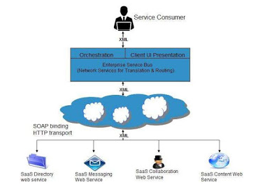
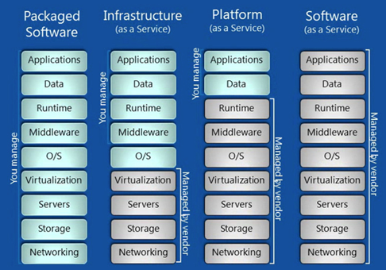

**Pertemuan Ketiga :**

# Software As a Service

Software as a service adalah salah satu layanan dari *Cloud Computing* dimana kita tinggal memakai software (perangkat lunak) yang telah disediakan. User hanya tahu bahwa perangkat lunak bisa berjalan dan bisa digunakan dengan baik.

**Contoh**
Layanan email publik (Gmail, YahooMail, Hotmail), *social network* (Facebook, Twitter, LinkedIn) *instant messaging* (Yahoo Messenger, Skype, Line, WhatsApp) dan masih banyak lagi yang lain.

Dalam perkembangan-nya, banyak perangkat lunak yang dulu hanya kita bisa nikmati dengan menginstall aplikasi tersebut di komputer kita (on-premise) mulai sekarang bisa kita nikmati lewat Cloud Computing. 

Keuntungan-nya, kita tidak perlu membeli lisensi dan tinggal terkoneksi ke internet untuk memakai-nya. Contoh, Microsoft Office yang sekarang kita bisa nikmati lewat Office 365, Adobe Suite yang bisa kita nikmati lewat Adobe Creative Cloud.

## Karakteristik *Software as a Service*

1. Membuat dan mengakses aplikasi SaaS melalui internet
2. Aplikasi software diurus oleh vendor bukan pelanggan
3. Lisensi untuk penggunaan aplikasi bersifat subscription (perbulan/pertahun), dan ditagih setiap bulan atau tahun.
4. Aplikasi SaaS hemat biaya karena tidak memerlukan maintenance oleh pelanggan.
5. Aplikasi tersedia sesuai permintaan
6. Aplikasi dapat di upgrade sesuai permintaan
7. SaaS menawarkan model sharing data. 
8. Semua pengguna menjalankan versi software yang sama.

## Jenis - Jenis *Software as a Service*
1. **Open Saas**
Open SaaS menggunakan aplikasi SaaS yang dikembangkan menggunakan bahasa pemrograman berbasis open source. Aplikasi SaaS ini dapat berjalan pada sistem operasi dan database open source manapun.

2. **SOA**
Aplikasi SaaS yang bersifat SOA bisa dijelaskan dari gambar dibawah :

## Kelebihan *Software as a Service*

1. Software aplikasi yang sederhana namun bermanfaat 
2. Efisien penggunaan lisensi software - Pelanggan dapat memiliki lisensi tunggal untuk beberapa komputer yang berjalan di lokasi yang berbeda yang mengurangi biaya lisensi
3. Pengelolaan dan data terpusat - Cloud computing  menyimpan data secara terpusat. Namun, penyedia cloud dapat menyimpan data dengan cara yang terdesentralisasi demi redundansi dan reliabilitas
4. Tanggung jawab platform dikelola oleh vendor SaaS - Semua tanggung jawab platform seperti backup, pemeliharaan sistem, keamanan, penyegaran perangkat keras, manajemen daya, dll dilakukan oleh penyedia cloud

## Kekurangan *Software as a Service*

1. Rentan terkena virus internet - Jika pelanggan mengunjungi situs web dan browser berbahaya yang terinfeksi virus, akses selanjutnya ke aplikasi SaaS mungkin akan membahayakan data pelanggan
2. Ketergantungan dengan internet - Aplikasi SaaS hanya bisa berjalan bila jaringan internet tersedia
3. Tidak bisa berbagi beban kerja cloud - Mentransfer beban kerja dari satu cloud SaaS ke cloud SaaS lainya tidak mudah karena alur kerja, logika bisnis, antarmuka pengguna, skrip dukungan dapat menjadi penyedia spesifik.

## Arsitektur 
Berikut ini arsitektur dan perbandingan Layanan *Software as a Service* dengan layanan - layanan *Cloud Computing* yang lainnya.

