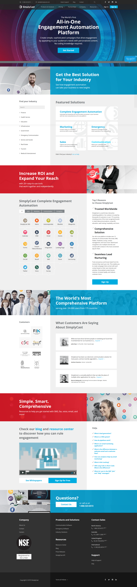

# Pertemuan 4

## Business Process as a Service
Proses Bisnis sebagai Layanan (BPaaS) adalah bentuk outsourcing proses bisnis (BPO) yang menggunakan model layanan *Cloud Computing*. Sedangkan tujuan BPO tradisional adalah untuk mengurangi biaya tenaga kerja, BPaaS mengurangi jumlah tenaga kerja melalui peningkatan otomatisasi, sehingga memotong biaya dalam proses.

Contoh aplikasi Business Process as a Service. 

### SimplyCast
www.simplycast.com  
*SimplyCast* adalah platform Komunikasi Aliran Pelanggan terbaik di dunia. Ini termasuk alat komunikasi dan pemasaran yang komprehensif namun sederhana. Pengguna dapat membuat kampanye otomatis canggih yang menarik bagi kebutuhan dan minat unik setiap pelanggan tanpa memiliki pengetahuan pengkodean.

**Misi SimplyCast** 
*SimplyCast* ingin memberi setiap bisnis dan organisasi kemampuan untuk menjangkau pelanggan mereka dengan mode komunikasi pilihan mereka. Solusi harga terjangkau *SimplyCast* memungkinkan bisnis kecil dan besar untuk membentuk hubungan yang kuat dengan pelanggan mereka, menghemat waktu, dan meningkatkan pendapatan.

**Misi SimplyCast** 
Visi utama *SimplyCast* adalah membangun solusi komunikasi paling komprehensif di pasar. *SimplyCast* ingin memberikan bisnis dengan kemampuan otomatisasi pemasaran yang kuat untuk membantu meningkatkan pengalaman dan hubungan pelanggan. *SimplyCast* telah mencapai tujuan itu.

**Tampilan SimplyCast** 

## Contoh lainnya :
1. Sales Auto Pilot www.salesautopilot.com
2. JumpLead https://jumplead.com/
3. LeadSius https://leadsius.com/
4. Mautic www.mautic.org