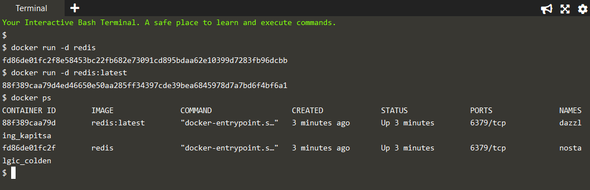
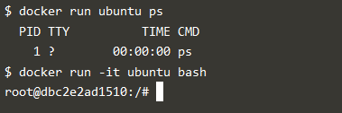

# DOCKER

## Deploying Docker Container

### Step 1 - Running A Container

Gambar diatas menunjukkan proses untuk melakukan identifikasi Docker Image yang dikonfigurasi untuk menjalankan Redis. Redis Docker Image yang  digunakan adalah versi terakhir dan karena Redis adalah sebuah basis data, maka dapat dijalankan sebagai layanan latar belakang.

### Step 2 - Finding Running Containers

Perintah seperti gambar diatas digunakan untuk menampilkan semua container yang sedang berjalan dan dapat menampilka nama dan id yang dapat digunakan untuk mengetahui informasi tentang masing - masing container.

### Step 3 - Accessing Redis

Redis telah berhasil dijalankan, namun tidak dapat diakses. Jika suatu layanan perlu diakses oleh proses yang tidak berjalan dalam suatu container, maka port perlu dieksport melalui Host. Secara default, Redis berjalan di port 6379. 
Kemudian dengan redisHostPort di port 6379 merupakan cara terbaik untuk menyelesaikan masalah tersebut. Secara default, port pada host dipetakan ke 0.0.0.0 yang berarti semua alamat IP dapat menentukan alamat IP tertentu ketika menentukan pemetaan port.

### Step 4 - Accessing Redis

Opsi -p 6379 memungkinkan untuk mengekspos Redis, tetapi pada port yang tersedia secara acak. Port mana yang telah ditetapkan tidak dapat diketahui, namun dapat ditemukan melalui port docker redisDynamic 6379.

### Step 5 - Persisting Data

Menggunakan dokumentasi Docker Hub untuk Redis. Data yang disimpan akan terus terhapus setiap menghapus dan membuat container baru. Setiap data yang disimpan di Host Docker dan bukan disimpan di container, harus disimpan di / opt / docker / data / redis.

### Step 6 - Running A Container In The Foreground

Menjalankan Ubuntu untuk meluncurkan container Ubuntu dan mengeksekusi perintah untuk melihat semua proses yang berjalan dalam container.