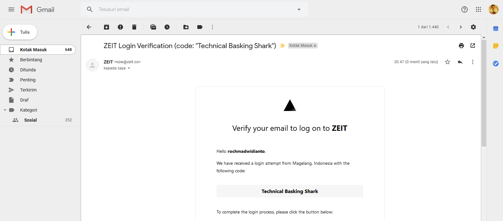

# PaaS - Platform As a Service

Ada beberapa contoh Paas, diantaranya : 
1. ZEIT https://zeit.co/
2. pythonanywhere https://www.pythonanywhere.com/
3. gigalixir https://gigalixir.com/

## ZEIT

**ZEIT** adalah nama perusahaannya, yang bertujuan membangun produk untuk pengembang dan desainer.
Sementara itu yang saya ketahui dari ZEIT adalah `Now`.
Now dari ZEIT adalah layanan deploy dan hosting service untuk static site. Di sana ada fitur global CDN, custom domain, dsb.
Intinya fungsinya sama seperti Firebase, Heroku, AWS, dsb.

**Langkah - Langkah Deploy di ZEIT**

Installing Now CLI with npm in the terminal.

Login with Now CLI from the terminal.

Email verifikasi login

Login berhasil

Creating a new Next.js project with npm.

Deploying your new Next.js project with Now CLI.

Deploy berhasil

Tampilan Running Aplikasi 
https://my-next-project.rochmadwidianto.now.sh/

## pythonanywhere

## gigalixir
